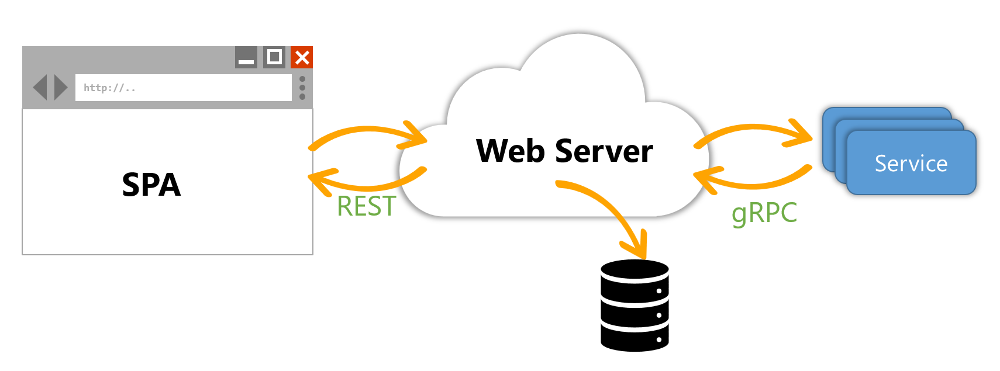

Your Technology Your Way: Full-stack Web and Service with .NET and Node
=======================================================================

These code samples compliment the presentation at https://robrich.org/slides/your-technology-your-way/#/

Architecture
------------

A client-side Single Page Application connects to a REST API. The REST API stores data in a database. A service periodically calls the API via gRPC.

In this sample are two implementations, one in C# and ASP.NET, one in TypeScript / Node.

You can mix-and-match these pieces to build an app your way.

License
-------

MIT
