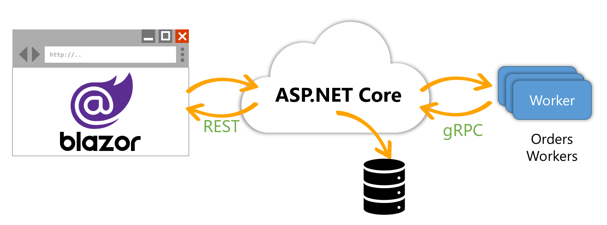

Your Technology Your Way: Full-stack Web and Service in ASP.NET and C# 10
=========================================================================



This sample uses these technologies:

- Blazor client-side SPA runs on WASM and includes no JavaScript
- ASP.NET Core Minimal APIs service the Blazor client
- The service uses the WorkerService template to run cross-platform services
- The service connects to the API via gRPC

Usage
-----

1. Start the solution using Visual Studio or VS Code.

2. In the solution explorer, right-click on the solution and choose startup projects.

3. Set both OrderProcess.Server and OrderProcess.Worker to start.

4. Start debugging the application. The Blazor app will start automatically. Browse to https://localhost:5001/swagger/ to see the REST API. Both REST and gRPC are running on this port.

5. Set breakpoints in any project to debug.


Build for production and test on the command line
-------------------------------------------------

1. Open a terminal in the csharp folder and run these:

   ```
   dotnet restore
   dotnet build -c Release
   dotnet publish -c Release -o dist/server OrderProcess.Server/OrderProcess.Server.csproj
   dotnet publish -c Release
   dotnet publish -c Release -o dist/worker OrderProcess.Worker.csproj
   ```

2. Run the website:

   Inside the dist/server directory run `dotnet OrderProcess.Server.dll`

3. Run the worker:

   In a new terminal, inside the dist/worker folder run `dotnet OrderProcess.Worker.exe`

4. Browse to https://localhost:5001/


Run as a Service on Windows
---------------------------

1. Open a terminal in the csharp folder and run these:

   ```
   dotnet restore
   dotnet build -c Release
   dotnet publish -c Release -o dist/server OrderProcess.Server/OrderProcess.Server.csproj
   dotnet publish -c Release
   dotnet publish -c Release -o dist/worker -r win-x64 --self-contained=true -p:PublishSingleFile=true -p:GenerateRuntimeConfigurationFiles=true OrderProcess.Worker/OrderProcess.Worker.csproj
   ```

   If we were going to publish exclusively to Windows, we'd probably put a lot of these flags in [the csproj](https://docs.microsoft.com/en-us/dotnet/core/deploying/single-file/overview#publish-a-single-file-app---sample-project-file)

2. Copy dist/server files into IIS

3. Install it as a Windows Service:

   ```
   sc.exe create "Order Service" binpath="C:\Path\To\csharp\dist\worker\OrderProcess.Worker.exe"
   ```

4. Start the service:

   ```
   net start "Order Service"
   ```

5. Stop and delete the Service when you're done:

   ```
   net stop "Order Service"
   sc.exe delete "Order Service"
   ```

Run as a Service on Linux
-------------------------

1. Open a terminal in the csharp folder and run these:

   ```
   dotnet restore
   dotnet build -c Release
   dotnet publish -c Release -o dist/server OrderProcess.Server/OrderProcess.Server.csproj
   dotnet publish -c Release
   dotnet publish -c Release -o dist/worker -r linux-x64 --self-contained=true -p:PublishSingleFile=true -p:GenerateRuntimeConfigurationFiles=true OrderProcess.Worker/OrderProcess.Worker.csproj
   ```

   If we were going to publish exclusively to Windows, we'd probably put a lot of these flags in [the csproj](https://docs.microsoft.com/en-us/dotnet/core/deploying/single-file/overview#publish-a-single-file-app---sample-project-file)

2. Copy dist/server files into a convinient location

3. Start the server:

   ```
   dotnet OrderProcess.Server.dll
   ```

4. Install worker as a Linux Service using the systemd instructions for your distribution. Use the files from dist/worker and start dist/worker/OrderProcess.Worker.so.
