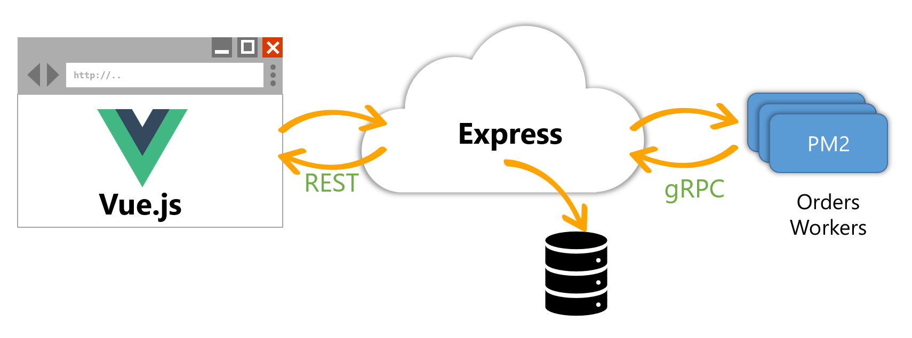

Your Technology Your Way: Full-stack Web and Service in Nodd.js and TypeScript
==============================================================================



This sample uses these technologies:

- Vue.js client-side SPA
- Express.js hosts both REST APIs and gRPC services
- Worker is a regular Node console app that can be run as a service in PM2
- Worker communicates with the API via gRPC


How to make devcert.pem
-----------------------

This process makes a pem & key that is the identical certificate that ASP.NET uses. This ensures there's no rootCA and that the two stacks will interoperate.

1. You'll need .NET and OpenSSL installed.

2. Create a .cert folder inside the node folder.

3. Run these commands from inside the .cert folder:

   ```sh
   dotnet dev-certs https --export-path ./devcert.pfx --password password
   openssl pkcs12 -in devcert.pfx -clcerts -nokeys -out devcert.pem
   # then type `password` (no quotes)
   openssl pkcs12 -in devcert.pfx -nocerts -out devcert.key-tmp
   # then type `password` (no quotes) 3 times
   openssl rsa -in devcert.key-tmp -out devcert.key
   rm devcert.key-tmp
   ```


Usage
-----

1. Export ASP.NET's development certificate into devcert.key and devcert.pem. (See above)

2. In the api folder, run `npm start` to both scaffold protos/ordershandler.proto into models/ordershandler.ts, build the TypeScript, and start the API. https is on port 3000, gRPC is on port 3001.

3. In the app folder, run `npm run dev` to build and launch the app using Vite. Or run `npm run serve` to launch the app using Vue CLI.

4. In the worker folder, run `npm start` to both scaffold protos/ordershandler.proto into models/ordershandler.ts, build the TypeScript, and start the service. It will connect to the Node app via gRPC on port 3001.


Run as a Service
----------------

1. `npm istall -g pm2`.

2. In the app folder run `npm run build`. This writes the client-side SPA into the api's public folder.

3. In the api folder run `npm run build`.

4. In the worker folder run `npm run build`.

5. In the node folder run `pm2 start` to load the ecosystem.config.js file into PM2.

6. Browse to https://localhost:3000/

Optional: want to run PM2 as a Windows service? Look at https://www.npmjs.com/package/pm2-windows-service. Even better: run the node apps in containers.
